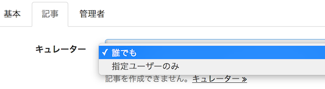
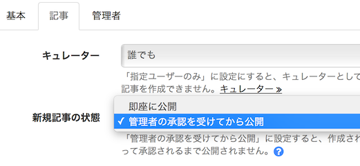

# 記事の管理

記事作成に関する設定、使用する記事アイテムの変更や拡張項目を追加できます。

## 誰でも投稿可能か、公認ライターのみか {#curator}

> サイト管理 > 記事設定 > 基本

### ライター

誰でも
: ユーザー登録すれば誰でも記事を作成することができます。

指定ユーザーのみ
: [ライターとして登録](../curators/)されたユーザー以外は記事を作成できません。

## 記事は即時公開か、承認してから公開か {#approve}

> サイト管理 > 記事設定 > 基本

### 新規記事の状態

即座に公開
: 記事が作成されると（記事に公開日時が設定されている場合はその日時になると）即座に公開されます。

管理者の承認を受けてから公開
: 作成された記事はサイト管理者によって承認されるまで公開されません。  
  ただし、一度承認された記事を更新した場合は、即座に公開反映されます。公開記事を下書きに戻した後、更新した場合は、再度承認待ちの状態になります。

## 記事アイテムの設定 {#items}

記事作成で使用するアイテム（コンテンツ部品）を選択できます。一部のアイテムの利用には別途オプション契約が必要な場合があります。

## 記事の拡張項目の設定 {#appends}

記事に日時情報や文字列などの拡張項目を追加することができます。拡張項目に入力された情報は「[テンプレート](design#templates)」や「[ページ](design#pages)」から利用することができます。
