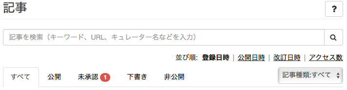
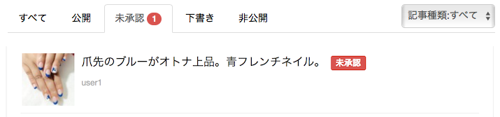
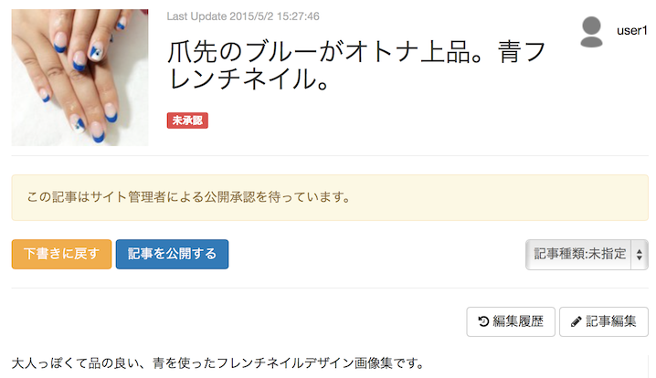
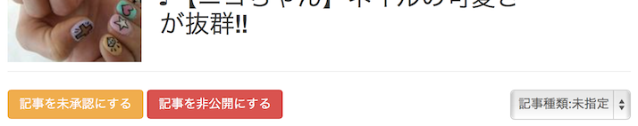
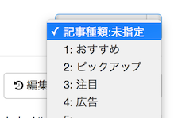

# 記事の管理

すべての記事の公開/公開中止制御や記事の編集ができます。

## 記事を探す {#search}

> サイト管理 > 記事

キーワード、もしくはクエリーを入力することで記事を検索できます。詳細は以下のページを参照ください。

» [記事の検索クエリー](../search_query/)

## 承認待ちの記事を承認して公開 {#approve}

> サイト管理 > 記事 > (記事を選択) > [記事を公開する]

[サイト設定](../sites/#approve)で「新規記事の状態」が「管理者の承認を受けてから公開」に設定されている場合、記事一覧に「未承認」のタブが現れ、承認待ちの記事が一覧表示されます。

記事を選択し、[記事を公開する] をクリックすると記事が公開されます。

## 公開中の記事を公開中止 {#disable}

> サイト管理 > 記事 > (記事を選択) > [記事を非公開にする]

公開中の記事を公開中止にするには、記事一覧から記事を選択し、[記事を非公開にする] をクリックします。

この操作により非公開となった記事は、記事作成者側から再公開することはできません。

## 記事種類を設定 {#kind}

> サイト管理 > 記事 > (記事を選択) > (記事種類を選択)

記事に1〜5の種別コードを設定できます。ここで設定したコードは「[テンプレート](../design/#templates)」から参照することができ、「おすすめ記事」「編集部ピックアップ」などの特別なカテゴリとして表示することができます。

## 記事を編集する {#edit}

> サイト管理 > 記事 > (記事を選択) > [記事編集]

記事一覧から記事を選択し、[記事編集] をクリックすることで、すべての記事を編集できます。

## 記事の変更履歴を確認 {#history}

> サイト管理 > 記事 > (記事を選択) > 変更履歴

編集や公開/非公開などのステータスの履歴を確認することができます。

## 記事のアクセス状況を確認 {#analytics}

> サイト管理 > 記事 > (記事を選択) > アクセス状況

公開記事のアクセス状況を確認することができます。

## 記事を削除する {#delete}

> サイト管理 > 記事 > (記事を選択) > [削除]

記事データを完全に削除するには、ページ一番下にある [削除] をクリックしてください。

ここに追加します
