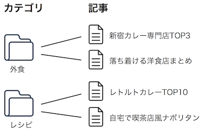

# カテゴリ

## カテゴリとは(テスト用の編集です。) {#about}

> サイト管理 > カテゴリ

カテゴリの種類は、あらかじめサイト管理者によって決められます。記事は作成者によって任意のカテゴリ1つに所属させることができます。

## カテゴリの登録 {#add}

> サイト管理 > カテゴリ > [追加]

すでにカテゴリが登録されている場合はカテゴリ一覧が表示されます。カテゴリをダブルクリックすると、編集およびカテゴリの削除ができます。

新しいカテゴリを作成するには、カテゴリ一覧ページ右上の [追加] をクリックします。

Permalink ID
: カテゴリページのURLで使用される固有の文字列です。未設定の場合はカテゴリ名称が使用されます。

名称
: カテゴリ名称です。

説明
: カテゴリの説明文です。カテゴリ詳細ページでの表示やdescription要素に使用されます。

画像
: カテゴリ詳細ページでの表示やOGP要素に使用される画像です。

アイコン
: トップページ等のカテゴリ一覧で表示されるアイコン画像です。

親カテゴリ
: 階層構造を持たせる場合、親とするカテゴリです。

## カテゴリの並べ替えと変更 {#index}

> サイト管理 > カテゴリ

### 変更

カテゴリ一覧で、項目をダブルクリックするか、選択状態で [変更] をクリックするとカテゴリの情報を変更することができます。

### 並べ替え

項目をドラッグ＆ドロップすることで、並び順を変更したり、階層を変更することができます。
