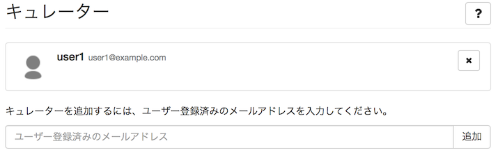
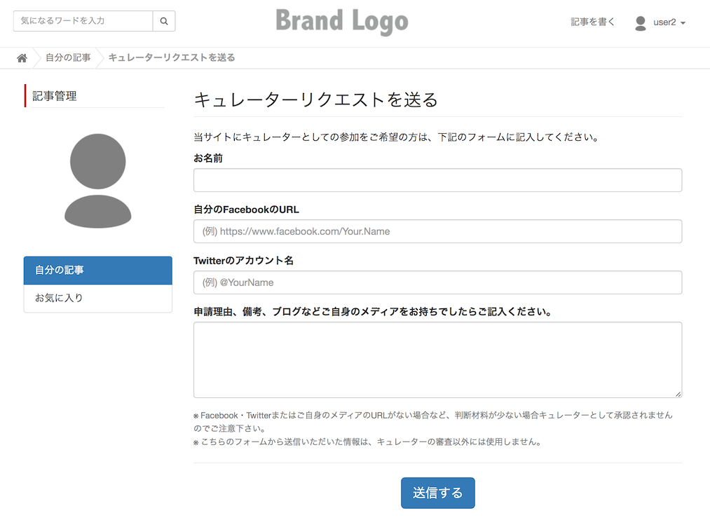

# ライターの管理

## ライターとは {#about}

本システムでは、記事作成者のことを、「ライター」と呼んでいます。

登録ユーザーが誰でもライターになれる（＝記事を書ける）モードと、あらかじめサイト管理者によって登録されたユーザーだけがライターになれるモード、どちらかの設定を選択することができます。この設定は「[記事設定](../article_settings/#curator)」で行うことができます。

## 公認ライターを登録 {#add}

> サイト管理 > ライター

「[記事設定](../article_settings/#curator)」で「ライター」が「指定ユーザーのみ」に設定されている場合、この機能でユーザーを指定することにより、ここで指定されたユーザーのみが記事を作成できるようになります。

追加するには、あらかじめユーザー登録されているユーザーの登録メールアドレスを入力してください。

## ライター応募フォームについて {#request}

「[記事設定](../article_settings/#curator)」で「ライター」が「指定ユーザーのみ」に設定されている場合、利用者が記事を書く操作を行うと、次のようなライター応募フォームが表示されます。

ここから応募が行われると、サイト作成者および、「[サイト設定](../sites/) > 通知」の「送信先メールアドレス」に設定したメールアドレス宛にメールが送信されます。応じる場合は前述のライター登録から登録を行ってください。
