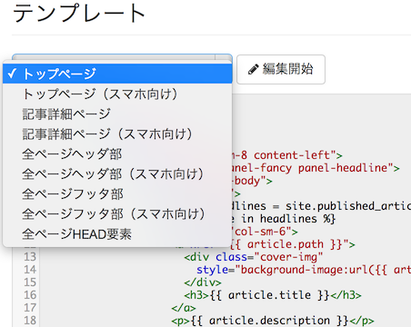
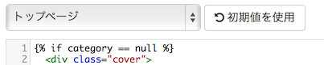
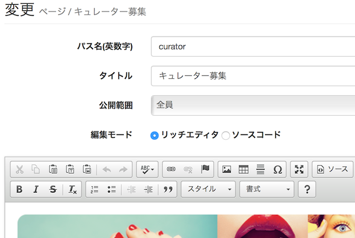
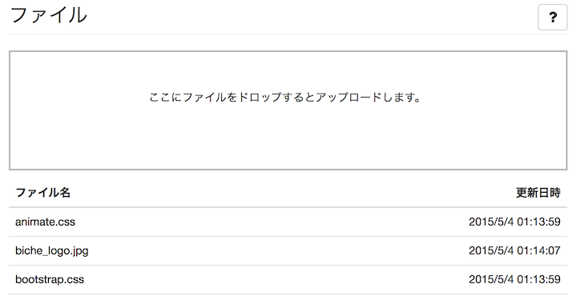
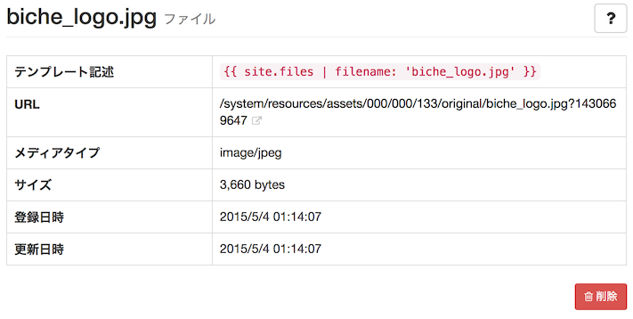
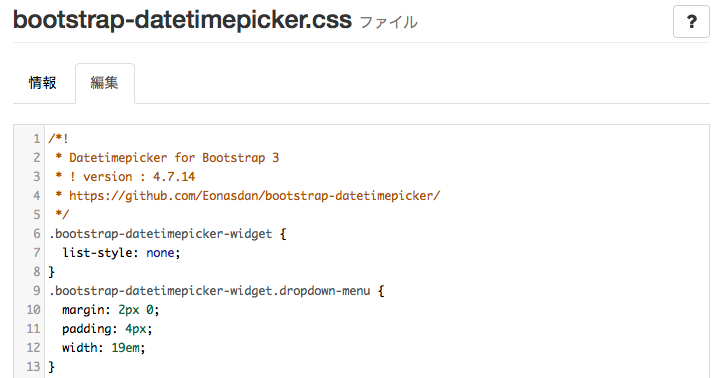

# サイトのデザインと追加ページ



テンプレートやページではテンプレート言語が使用できます。次の情報も参照してください。

- [テンプレート言語Liquid](../liquid/)
- [Liquid拡張タグ](../liquid_ex/)
- [オブジェクトリファレンス](../tmpl_objects/)

## テーマ {#themes}

> サイト管理 > テーマ

テーマは、サイトのデザインテンプレートパッケージです。「テンプレート」「ページ」「ファイル」「ウィジェット」の要素で構成されます。サードパーティ製のテーマをアップロードして適用したり、さらにそれを自由に編集したりすることができます。

作成したテーマはサイト全体のデザインとして適用できる他、記事ごと、あるいはページごとに個別に適用することもできます。

### ダウンロード

テーマに紐付けられたテンプレート、ページ、ファイル、ウィジェットを、1つのテーマファイルとしてダウンロードすることができます。

## テンプレート {#templates}

> サイト管理 > テーマ > (テーマを選択) > [テンプレート]

テンプレートをカスタマイズすることで、サイトのデザインを細かく変更したり、広告を挿入することなどができます。

### レイアウトテンプレート

レイアウトテンプレートはHTML全体部分（`<html>`〜`</html>`）が定義されます。すべてのページで共通のフッタやヘッダ部分の表示や、CSSの読み込みや共通のJavaScriptコードなどはここで定義します。

コンテンツテンプレートで定義された変数は、レイアウトテンプレートで参照できます。

### コンテンツテンプレート

フロント側の一部ページ（トップページや記事詳細ページなど）を定義できます。

変更したい項目を選択して、[編集開始] をクリックすると、編集が可能になります。



変更をやめてテンプレートをシステムデフォルトの状態に戻すには、[初期値を使用] をクリックしてから保存します。



### パーシャルテンプレート

他のテンプレートやページ内から利用できる、再利用可能な部分テンプレートを作ることができます。

パーシャルテンプレートはLiquidタグ `` で読み込むことができます。

## ページ {#pages}

> サイト管理 > ページ

追加のページを作成することができます。利用規約やプライバシーポリシーなどの静的なページはもとより、テンプレート言語が使用可能なので、サイトの情報を使用した動的なページまで応用できます。



パス名(英数字)
: ページURLとして使用されます。

タイトル
: ページのタイトルです。

編集モード
: テンプレート言語を使用する場合はソースコードモードの使用をおすすめします。

## ファイル {#files}

> サイト管理 > ファイル

画像、js、cssなどの静的ファイルをアップロードできます。アップロードしたファイルはテンプレートやページから利用できます。



ドラッグ＆ドロップでファイルをアップロードすることができます。ドラッグ＆ドロップに未対応の一部ブラウザでは、クリックしてファイルを選択できます。ShiftやCtrl(cmd)キーを押しながら選択することで複数ファイルを選択し、まとめてアップロードできます。

アップロードされたファイル一覧が表示されます。ファイルをクリックすると詳細が表示されます。



### ファイルの利用方法

「テンプレート記述」に表示された文字列をテンプレートやページ内に書くことで、URLを参照することができます。

例）

```

```

### ファイルの編集

.cssや.jsなどのテキストファイルはここで直接編集することもできます。




### Sass、CoffeeScript、ES6(2015)+の自動コンパイル

Sass（拡張子.scss/.sass）、CoffeScript（拡張子.coffee）、ES6(2015)+（拡張子.mjs）ファイルをアップロード、もしくは編集すると、自動的にコンパイル結果を出力します。

例えばsample.css.scssもしくはsample.scssというファイル名でファイルを作成すると、sample.cssというファイル名でコンパイル結果が出力されます。すでにファイルが存在する場合は上書きされます。

## ウィジェット {#widgets}

> サイト管理 > ウィジェット

テンプレートやページ内から利用できる、再利用可能な部品を作ることができます。

パーシャルテンプレートと似ていますが、広告やブログパーツなど、デザイン制作者以外の方によって変更する可能性のあるパーツを定義するのに向いています。

ウィジェットはLiquidタグ``で読み込むことができます。

## フォーム {#forms}

> サイト管理 > フォーム

アンケートや問い合わせのフォームを作ることができます。

作成したフォームは固定ページに配置したり、ウィジェット化して記事内に配置することができます。

フォームはLiquidタグ `` で読み込むことができます。


