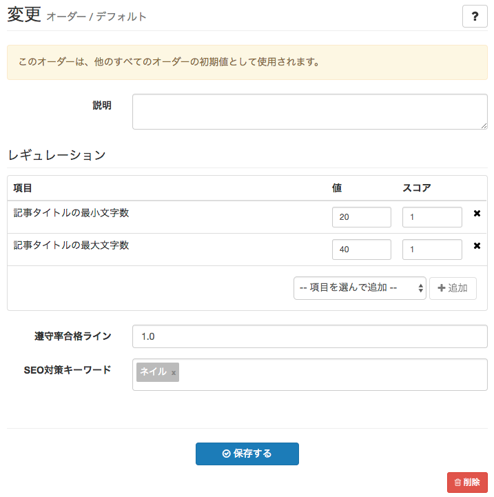

# オーダー管理

## オーダーとは {#about}

書いてもらいたい記事の依頼内容や、雛形、記事作成のルールなどを登録し、ライターに提示することができます。

## デフォルトオーダーを登録 {#add_default}

> サイト管理 > オーダー > [デフォルトオーダーを作成]

デフォルトオーダーは、サイト全体の共通の記事作成ルールです。

説明
: 説明文です。記事作成画面上に表示されます。

レギュレーション
: **項目** : 守ってほしいルールの項目を設定します。  
**値** : 文字数などの値を設定します。項目によっては設定する必要のないものもあります。  
**スコア** : 条件を満たした時に付与するスコアです。初期値は1です。より大きな値を指定することで項目ごとに重みを変える返ることができます。

遵守率合格ライン
: レギュレーション項目で設定したスコア値の合算で、全体の何割のルールを満たせば合格とするかの設定です。0〜1.0の範囲で指定します。初期値は1.0で、100%満たした場合に合格となります。  
**本機能における合否チェックは、目安として表示されるものであり、この基準を満たさないと出稿を受け付けない、というものではありません。**

SEO対策キーワード
: SEO対策上重視するキーワードを設定します。キーワードの使用数チェックなど、一部のレギュレーション項目で使用されます。

## カスタムオーダーを登録 {#add_custom}

> サイト管理 > オーダー > [追加]

複数のルールセットを登録することができます。ライターはカスタムオーダーを選択して記事作成を開始することができます。

### 雛形記事

カスタムオーダーでは、登録されている下書き記事を雛形として指定することができます。雛形記事が設定されたオーダーから記事作成を開始すると、雛形記事を元に記事下書きが作成されます。

## オーダーから記事を書くには {#article}

1つ以上のカスタムオーダーが登録されていると、自分の記事一覧ページに [オーダーから記事を作成] ボタンが表示されます（カスタムオーダーが登録されていない場合は表示されません）。ここをクリックするとオーダー一覧が表示されます。
