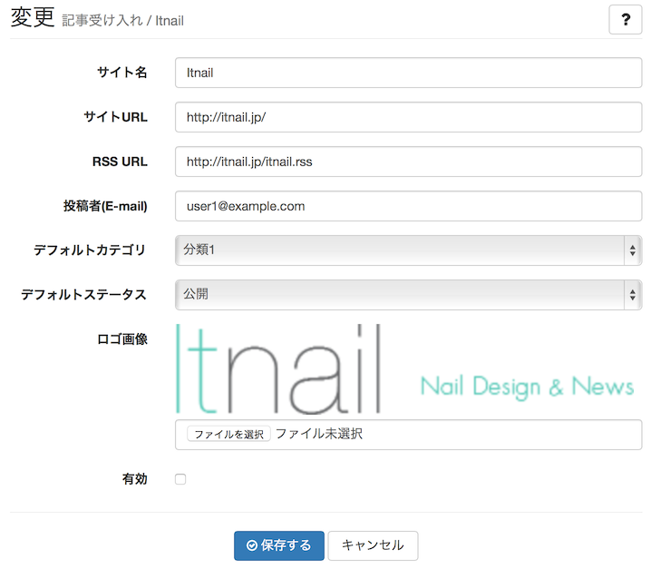
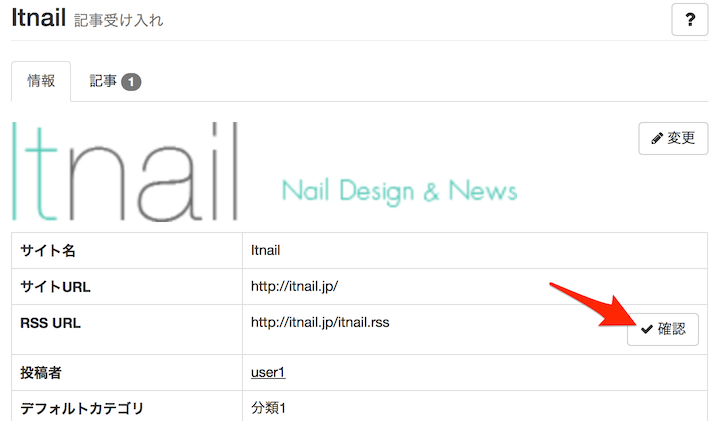
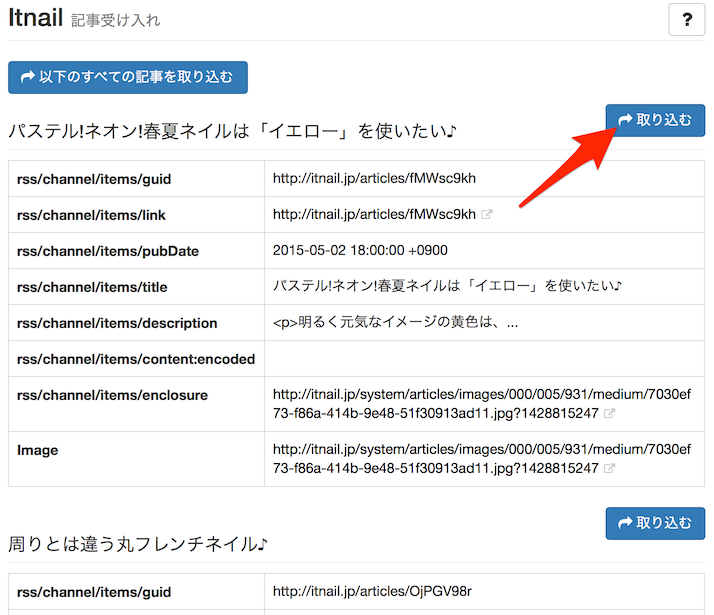
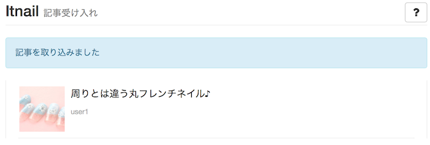

# 記事入稿 (RSS受信)

他社メディアサイトの記事配信RSSを受信し、自動的に取り込むことができますます。2次メディア型キュレーション サイトの構築が可能です。

RSSは本システムの[記事受け入れ用RSSの仕様](../import_rss_spec/)に準拠している必要があります。

## 外部メディアの記事を受け入れる

> サイト管理 > 記事入稿 (RSS受信) > [追加]

新しい配信元を作成するには、記事配信元一覧ページ右上の [追加] をクリックします。

サイト名
: 配信元のサイト名。

サイトURL
: 配信元のサイトトップページURL。記事からのリンクに使用されます。

RSS URL
: RSSフィードのURLです。本システムの[記事受け入れ用RSSの仕様](import_rss_spec)に準拠している必要があります。

投稿者(E-mail)
: 投稿者とするユーザーです。あらかじめユーザー登録されているユーザーの登録メールアドレスを入力してください。

デフォルトカテゴリ
: 指定のカテゴリに記事を投稿します。

デフォルトステータス
: 取り込み時に即時公開状態とするのか、承認待ちの状態にするのかの設定です。

更新記事の受け入れ
: ONにすると、受け入れ済みの記事の改訂版を受信した時に、記事を更新します。

ロゴ画像
: 配信元サイトのロゴ画像です。記事ページでで使用されます。

有効
: 有効にチェックすると、1時間に1回、自動的に取り込みを行います。

## RSSのチェック

> サイト管理 > 記事入稿 (RSS受信) > (配信元を選択) > [確認]

配信RSSが有効で、記事の取り込みが可能かどうか確認します。

配信元一覧から配信元を選び、RSS URL [確認] をクリックします。

正常にRSSが読み込まれると上図のように表示されますので、適当な記事の [取り込む] をクリックして、1記事を取り込んでみます。

正常に取り込めない場合は、[記事受け入れ用RSSの仕様](../import_rss_spec/)をご確認ください。
