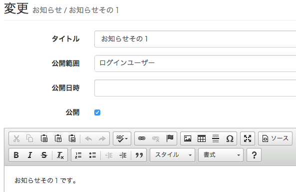

# お知らせの管理

ログインユーザー／ライターへのお知らせを管理します。

## お知らせの登録と編集

> サイト管理 > お知らせ

タイトル
: ページのタイトルです。

公開範囲
: ログインユーザー全員公開以外に、公認ライターのみ、の指定が可能です。

公開日時
: 指定日時に自動公開することができます。

公開
: チェックを外すとお知らせを非公開にします。

内容
: テンプレート言語の使用が可能なので、「サイト管理 > [ファイル](../design/#files)」からアップロードした画像などを参照することもできます。
