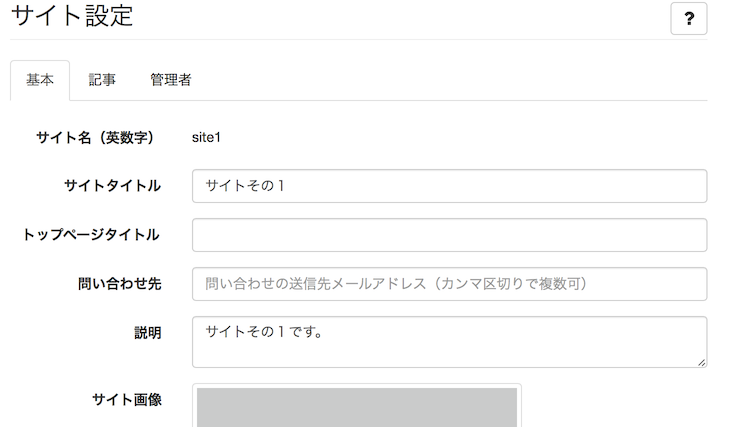

# サイト設定

サイト名称、ロゴ画像、管理者の追加等の各種設定など、サイトの基本的な設定を行います。

## サイト名やロゴ画像などを変更する {#basic}

> サイト管理 > サイト設定 > 基本情報

### 設定項目

サイトタイトル
: サイトタイトルはすべてのページの `<title>` 要素で使用されます。

トップページタイトル
: トップページの `<title>` 要素に入るタイトルです。

説明
: トップページのmeta description要素やOGP要素で使用される、サイトの説明文です。

サイト画像
: トップページのOGP要素で使用される画像です。

ロゴ画像
: サイトのヘッダ部などで使用されるロゴ画像です。

ロゴ画像(スマホ用)
: スマホ向けの表示で使用されるサイトのロゴ画像です。

Favicon
: ブラウザのアドレスバーなどに表示される小さなアイコン画像です。

apple-touch-icon
: スマホ向けのアイコン画像です。
