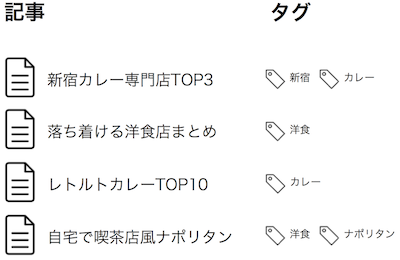
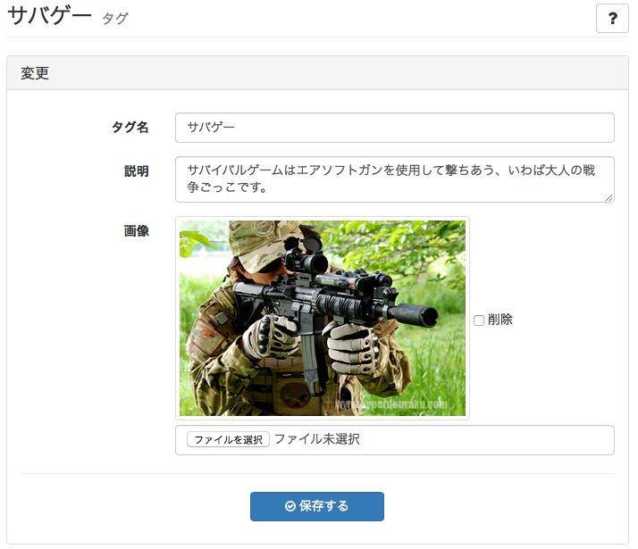
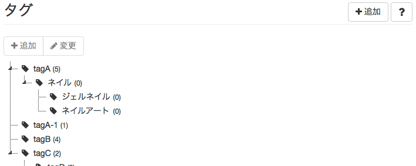

# タグ

## タグとは {#about}

> サイト管理 > タグ

タグとは記事に関連するキーワードを表す任意の文字列です。記事には複数個のタグを付けることができます。

タグは記事作成者によって付けられる任意の文字列ですが、サイト管理者によって名前の変更、削除、他のタグとの統合ができます。

## タグの一覧表示と検索

> サイト管理 > タグ

### 検索

デフォルトの一覧表示と何も入力せず検索した場合は、最近更新したタグの第一階層100件が表示されます。

検索は、入力した値がタグ名に含まれるタグが表示されます。

### 注意点

全タグを取得はタグが増えてきた場合に、取得が重くなる可能性がありますので実行時にはご注意ください。

## タグ名の変更と説明/画像の設定 {#edit}

> サイト管理 > タグ > [変更]

タグ名を変更できます。また、タグ詳細ページで表示される説明文と画像を設定することができます。

タグ名
: タグ名です。

説明
: タグの説明文です。タグ詳細ページでの表示やdescription要素に使用されます。

画像
: タグ詳細ページでの表示やOGP要素に使用される画像です。

親タグ
: 階層構造を持たせる場合、親とするカテゴリです。

## タグの移動（他のタグへ統合） {#move}

> サイト管理 > タグ > [変更]

タグを他のタグと統合します。似た内容のタグを1つにまとめることができます。

## タグの削除 {#delete}

> サイト管理 > タグ > [変更]

不要になったタグを削除できます。そのタグが付けられたすべての記事との関連付けが解除されます。

## タグの並べ替えと変更 {#index}

> サイト管理 > タグ

### 変更

タグ一覧で、項目をダブルクリックするか、選択状態で [変更] をクリックするとタグの情報を変更することができます。

### 並べ替え

項目をドラッグ＆ドロップすることで、階層を変更することができます。
